<!-- ═══════════════════════════════════════════════════════════════════════════════ -->
<!-- 🔥 TOP CUSTOM BANNER PHOTO -->
<!-- ═══════════════════════════════════════════════════════════════════════════════ -->
<div align="center">
  
</div>

<div align="center">

  <!-- Animated Gradient Wave Subtitle -->
  

  <!-- Dynamic Typing Headline -->
  <a href="https://git.io/typing-svg">
    
  </a>

  <br/>

  <!-- Quick Action Badges & Telemetry -->
  <p align="center">
    <a href="https://www.linkedin.com/in/shivangi-maurya-bba074380" target="_blank">
      
    </a>
    <a href="mailto:mauryashivi199@gmail.com" target="_blank">
      
    </a>
    
    
  </p>

</div>

---

<!-- ═══════════════════════════════════════════════════════════════════════════════ -->
<!-- 🧑‍💻 HOLOGRAPHIC TERMINAL & ABOUT ME -->
<!-- ═══════════════════════════════════════════════════════════════════════════════ -->
<table>
  <tr>
    <td width="62%" valign="top">
      <h3>⚡ <code>system.info --whoami</code></h3>
      
```bash
$ shivangi --status --verbose

[+] USER        : Shivangi Maurya (Shivi)
[+] PASSION     : DevOps Automation, RAG AI & Cloud Native Engineering
[+] DEGREE      : B.Tech CSE (2023 - 2027) | MGIMT Lucknow 🎓
[+] TRAINING    : CTS Parakeet — DevOps & Cloud Track 🚀
[+] TARGET      : Actively seeking DevOps & Cloud Internship Roles 🎯
[+] MINDSET     : "Automate everything repeatable, build resilient systems."
[+] SUPERPOWER  : "I debug in production and call it 'Live Testing' 😎"
```

  * 🧠 **Specialization:** End-to-end RAG AI pipelines, Vector Search, Containerized Microservices & Cloud Infrastructure.
  * ☁️ **Cloud Stack:** AWS (EC2, S3, IAM, VPC), Docker, Kubernetes, Terraform (IaC), GitHub Actions & Jenkins.
  * 💬 **Let's Talk About:** `RAG AI Systems`, `CI/CD Automation`, `Docker & K8s`, `Linux Kernel & Shell`.
    </td>
    <td width="38%" align="center" valign="middle">
      
    </td>
  </tr>
</table>

---

<!-- ═══════════════════════════════════════════════════════════════════════════════ -->
<!-- 🛠️ INTERACTIVE TECH STACK MATRIX -->
<!-- ═══════════════════════════════════════════════════════════════════════════════ -->
## 🛠️ Tech Stack & Cloud Arsenal

<div align="center">

  <!-- Interactive Icon Grid -->
  <a href="https://skillicons.dev">
    
  </a>

  <br/><br/>

  <!-- High Impact Categorized Shields -->
  <p>
    
    
    
    
    
    
  </p>

</div>

---

<!-- ═══════════════════════════════════════════════════════════════════════════════ -->
<!-- 🔄 DEVOPS & RAG AI CI/CD PIPELINE ARCHITECTURE FLOW -->
<!-- ═══════════════════════════════════════════════════════════════════════════════ -->
### 🔄 Deployment & Cloud Automation Architecture

```mermaid
graph LR
    A[💻 Code Push / PR] -->|Webhook Trigger| B[⚙️ GitHub Actions / Jenkins]
    B -->|PyTest & Linter Suites| C[🧪 Automated Testing]
    C -->|Multi-Stage Build| D[🐳 Docker Image Registry]
    D -->|Zero-Downtime Deploy| E[☁️ AWS Cloud Host / DuckDNS]
    E -->|Real-Time Services| F[🤖 RAG AI & SaaS Live Apps]
    
    style A fill:#0d1117,stroke:#00F0FF,stroke-width:2px,color:#fff
    style B fill:#0d1117,stroke:#FF9900,stroke-width:2px,color:#fff
    style C fill:#0d1117,stroke:#326CE5,stroke-width:2px,color:#fff
    style D fill:#0d1117,stroke:#2496ED,stroke-width:2px,color:#fff
    style E fill:#0d1117,stroke:#00D9FF,stroke-width:2px,color:#fff
    style F fill:#0d1117,stroke:#4EAA25,stroke-width:2px,color:#fff
```



---

<!-- ═══════════════════════════════════════════════════════════════════════════════ -->
<!-- 📈 DEVOPS SKILL METRICS & ROADMAP -->
<!-- ═══════════════════════════════════════════════════════════════════════════════ -->
### ⚡ Skill Proficiency & Roadmap Meter

| Core Competency | Mastery Meter | Status Level |
| :--- | :--- | :---: |
| 🐧 **Linux Administration & Bash Scripting** | `████████████████████` **100%** |  |
| 🐙 **Git, GitHub & Branching Workflows** | `████████████████████` **100%** |  |
| 🐳 **Docker Multi-Stage & Containerization** | `████████████████░░░░` **85%** |  |
| ☁️ **AWS Cloud Architecture (EC2, S3, IAM, VPC)** | `██████████████░░░░░░` **75%** |  |
| 🤖 **RAG AI & Vector Search Engineering** | `██████████████░░░░░░` **70%** |  |
| 🔄 **CI/CD Pipelines (GitHub Actions & Jenkins)** | `████████████░░░░░░░░` **65%** |  |
| ☸️ **Kubernetes Orchestration & Pod Scaling** | `████████████░░░░░░░░` **60%** |  |
| 🏗️ **Terraform & Infrastructure as Code** | `████████░░░░░░░░░░░░` **45%** |  |

---

<!-- ═══════════════════════════════════════════════════════════════════════════════ -->
<!-- 🚀 6 FEATURED ENGINEERING PROJECTS MATRIX -->
<!-- ═══════════════════════════════════════════════════════════════════════════════ -->
## 🚀 Featured Engineering Projects Showcase

<table>
  <!-- ROW 1: RAG AI & EMS 2.0 -->
  <tr>
    <td width="50%" valign="top">
      <div align="center">
        <h3>🤖 RAG Chat Intelligence Platform</h3>
        <p><b>Production-Grade RAG AI Assistant with Vector Search</b></p>
      </div>
      <p>
        AI-powered conversational intelligence system with vector embeddings, semantic retrieval over custom knowledge docs, contextual memory, and low-latency token streaming.
      </p>
      <p align="center">
        
        
        
        
      </p>
      <p align="center">
        <a href="https://ragchat-app.duckdns.org" target="_blank">
          
        </a>
      </p>
    </td>
    <td width="50%" valign="top">
      <div align="center">
        <h3>💼 EMS 2.0 — Commercial Cloud HRMS</h3>
        <p><b>Enterprise Workforce Management & SaaS Solution</b></p>
      </div>
      <p>
        Complete HRMS suite with JWT role-based security, GPS geofenced attendance punch-in, automated 12% PF salary generator, candidate pipeline, and Dockerized backend.
      </p>
      <p align="center">
        
        
        
        
      </p>
      <p align="center">
        <a href="https://github.com/mauryashivi199-ui/employee-management-system" target="_blank">
          
        </a>
      </p>
    </td>
  </tr>

  <!-- ROW 2: CI/CD PIPELINE & S3 ARCHIVER -->
  <tr>
    <td width="50%" valign="top">
      <div align="center">
        <h3>🔄 End-to-End Automated CI/CD Cloud Pipeline</h3>
        <p><b>Zero-Downtime Continuous Integration & Cloud Deployment</b></p>
      </div>
      <p>
        Fully automated CI/CD pipeline triggered on GitHub Webhooks, executing test suites, building multi-stage Docker images, and deploying to AWS EC2 with health checks.
      </p>
      <p align="center">
        
        
        
        
      </p>
      <p align="center">
        
      </p>
    </td>
    <td width="50%" valign="top">
      <div align="center">
        <h3>🗂️ Auto Log Archiver & Cloud Alerting Daemon</h3>
        <p><b>Automated SRE Log Compression & AWS S3 Storage</b></p>
      </div>
      <p>
        Background system daemon written in Python to compress gigabytes of production logs, stream them to AWS S3 Glacier buckets, and dispatch webhook alerts on errors.
      </p>
      <p align="center">
        
        
        
        
      </p>
      <p align="center">
        
      </p>
    </td>
  </tr>

  <!-- ROW 3: SAFEHER & CLOUDOPS CONSOLE -->
  <tr>
    <td width="50%" valign="top">
      <div align="center">
        <h3>👩‍🦺 SafeHer — Women Safety SOS & Geo-Tracker</h3>
        <p><b>Real-time Emergency Dispatcher & GPS Tracker</b></p>
      </div>
      <p>
        Full-stack responsive application with instant live GPS coordinate broadcast, emergency SMS dispatch gateway, and nearby safe zones mapping.
      </p>
      <p align="center">
        
        
        
      </p>
      <p align="center">
        
      </p>
    </td>
    <td width="50%" valign="top">
      <div align="center">
        <h3>🖥️ CloudOps Central — DevOps Console Dashboard</h3>
        <p><b>Real-Time Container & Server Infrastructure Monitor</b></p>
      </div>
      <p>
        Interactive frontend dashboard monitoring Docker container states, CPU/Memory telemetry metrics, server uptime, and active deployment logs.
      </p>
      <p align="center">
        
        
        
      </p>
      <p align="center">
        
      </p>
    </td>
  </tr>
</table>

---

<!-- ═══════════════════════════════════════════════════════════════════════════════ -->
<!-- 📊 LIVE DYNAMIC ANALYTICS & VISUAL CHARTS (100% WORKING) -->
<!-- ═══════════════════════════════════════════════════════════════════════════════ -->
## 📊 Real-Time GitHub Analytics & Graphs

<div align="center">
  
  
</div>

<div align="center">
  <br/>
  
  
</div>

<div align="center">
  <br/>
  
</div>

---

<!-- ═══════════════════════════════════════════════════════════════════════════════ -->
<!-- 🐍 CONTRIBUTION SNAKE GAME ANIMATION -->
<!-- ═══════════════════════════════════════════════════════════════════════════════ -->
## 🐍 GitHub Contribution Snake Game

<div align="center">
  
</div>

---

<!-- ═══════════════════════════════════════════════════════════════════════════════ -->
<!-- 🤝 CONNECT & COLLABORATE -->
<!-- ═══════════════════════════════════════════════════════════════════════════════ -->
<div align="center">

  <h2>🌐 Let's Build Something Extraordinary!</h2>

  <p>I am actively seeking <strong>DevOps Internship, Cloud Engineer, or AI/Full-Stack Engineering roles.</strong><br/>Feel free to reach out for collaborations, hackathons, or open-source discussions!</p>

  <p align="center">
    <a href="https://www.linkedin.com/in/shivangi-maurya-bba074380" target="_blank">
      
    </a>
    &nbsp;&nbsp;
    <a href="mailto:mauryashivi199@gmail.com" target="_blank">
      
    </a>
    &nbsp;&nbsp;
    <a href="https://github.com/mauryashivi199-ui" target="_blank">
      
    </a>
  </p>

  <br/>

  <a href="https://git.io/typing-svg">
    
  </a>

  <br/><br/>
  

</div>
