<div align="center">

  <!-- ═══════════════════════════════════════════════════════════════════════════════ -->
  <!-- 🚀 DYNAMIC NEON HEADER BANNER -->
  <!-- ═══════════════════════════════════════════════════════════════════════════════ -->
  

  <!-- ═══════════════════════════════════════════════════════════════════════════════ -->
  <!-- ⚡ ANIMATED MULTI-LINE TYPING EFFECT -->
  <!-- ═══════════════════════════════════════════════════════════════════════════════ -->
  <a href="https://git.io/typing-svg">
    
  </a>

  <br/>

  <!-- ═══════════════════════════════════════════════════════════════════════════════ -->
  <!-- 🌐 QUICK ACTION BADGES & LIVE TELEMETRY -->
  <!-- ═══════════════════════════════════════════════════════════════════════════════ -->
  <p align="center">
    <a href="https://www.linkedin.com/in/shivangi-maurya-bba074380" target="_blank">
      
    </a>
    <a href="mailto:mauryashivi199@gmail.com" target="_blank">
      
    </a>
    
    
  </p>

  <!-- 🏆 GITHUB TROPHIES -->
  <p align="center">
    
  </p>

</div>

---

<!-- ═══════════════════════════════════════════════════════════════════════════════ -->
<!-- 🧑‍💻 HOLOGRAPHIC TERMINAL & ABOUT ME -->
<!-- ═══════════════════════════════════════════════════════════════════════════════ -->
<table>
  <tr>
    <td width="60%" valign="top">
      <h3>⚡ <code>system.info --whoami</code></h3>
      
```bash
$ shivangi --status --verbose

[+] USER        : Shivangi Maurya (Shivi)
[+] PASSION     : DevOps, RAG AI Architectures & Cloud Native Systems
[+] DEGREE      : B.Tech CSE (2023 - 2027) | MGIMT Lucknow 🎓
[+] TRAINING    : CTS Parakeet — DevOps & Cloud Track 🚀
[+] TARGET      : Actively seeking DevOps & Cloud Internship Roles 🎯
[+] MINDSET     : "Automate everything repeatable, build resilient systems."
[+] SUPERPOWER  : "I debug in production and call it 'Live Testing' 😎"
```

  * 🧠 **Specialization:** End-to-end RAG AI pipelines, Vector Search, Containerized Microservices & Cloud Infrastructure.
  * ☁️ **Cloud Stack:** AWS (EC2, S3, IAM, VPC), Docker, Kubernetes, Terraform (IaC), GitHub Actions & Jenkins.
  * 💬 **Let's Talk About:** `RAG AI Systems`, `CI/CD Automation`, `Docker & K8s`, `Linux Kernel & Shell`.
    </td>
    <td width="40%" align="center" valign="middle">
      
    </td>
  </tr>
</table>

---

<!-- ═══════════════════════════════════════════════════════════════════════════════ -->
<!-- 🚀 FEATURED HIGHLIGHT PROJECTS (WITH LIVE DEMOS & SCREENSHOTS) -->
<!-- ═══════════════════════════════════════════════════════════════════════════════ -->
## 🚀 Featured Engineering Projects

<table>
  <!-- PROJECT 1: RAG CHAT SYSTEM -->
  <tr>
    <td colspan="2" align="center" style="background-color: #0d1117;">
      <h2 align="center">🤖 RAG Chat Intelligence Platform (Live AI App)</h2>
      <a href="https://ragchat-app.duckdns.org" target="_blank">
        
      </a>
      <p align="center">
        <b>Production-Grade Retrieval-Augmented Generation (RAG) Conversational System</b> with Vector Embeddings, Contextual Semantic Search, Document QA, and Real-Time Low-Latency AI Streaming.
      </p>
      <p align="center">
        
        
        
        
        
      </p>
      <p align="center">
        <a href="https://ragchat-app.duckdns.org" target="_blank">
          
        </a>
      </p>
    </td>
  </tr>

  <!-- PROJECT 2 & 3: EMS 2.0 & CI/CD PIPELINE -->
  <tr>
    <td width="50%" valign="top">
      <h3 align="center">💼 EMS 2.0 — Enterprise SaaS HRMS</h3>
      <div align="center">
        
      </div>
      <p>
        Commercial Workforce Management Platform featuring JWT authentication, GPS geofenced punch-in, 12% PF automated payroll, and Dockerized backend.
      </p>
      <p align="center">
        
        
        
        
      </p>
      <p align="center">
        <a href="https://github.com/mauryashivi199-ui/employee-management-system"><b>🔗 View Source Code →</b></a>
      </p>
    </td>
    <td width="50%" valign="top">
      <h3 align="center">🔄 Automated CI/CD Deployment Pipeline</h3>
      <div align="center">
        
      </div>
      <p>
        Zero-downtime continuous integration and automated deployment pipeline targeting AWS EC2 instances with GitHub Actions and Jenkins suites.
      </p>
      <p align="center">
        
        
        
        
      </p>
      <p align="center">
        <b>⚡ Production Cloud Deploy</b>
      </p>
    </td>
  </tr>

  <!-- PROJECT 4 & 5: S3 ARCHIVER & SAFEHER -->
  <tr>
    <td width="50%" valign="top">
      <h3 align="center">🗂️ Auto Log Archiver & Cloud Alerting</h3>
      <p>
        Daemon script to compress multi-GB server logs, stream them to AWS S3 Glacier buckets, and trigger automated webhook alerts.
      </p>
      <p align="center">
        
        
        
      </p>
      <p align="center">
        <b>🛠️ SRE Infrastructure Utility</b>
      </p>
    </td>
    <td width="50%" valign="top">
      <h3 align="center">👩‍🦺 SafeHer — Women Safety Web App</h3>
      <p>
        Full-stack responsive application with real-time GPS coordinates broadcasting, one-touch SOS emergency dispatcher, and SMS routing.
      </p>
      <p align="center">
        
        
        
      </p>
      <p align="center">
        <b>✅ Completed Project</b>
      </p>
    </td>
  </tr>
</table>

---

<!-- ═══════════════════════════════════════════════════════════════════════════════ -->
<!-- 🛠️ INTERACTIVE TECH STACK MATRIX -->
<!-- ═══════════════════════════════════════════════════════════════════════════════ -->
## 🛠️ Tech Stack & Arsenal

<div align="center">

  <!-- Interactive Icon Grid -->
  <a href="https://skillicons.dev">
    
  </a>

  <br/><br/>

  <!-- High Impact Categorized Shields -->
  <p>
    
    
    
    
    
    
  </p>

</div>

---

<!-- ═══════════════════════════════════════════════════════════════════════════════ -->
<!-- 🔄 DEVOPS & RAG AI CI/CD PIPELINE ARCHITECTURE FLOW -->
<!-- ═══════════════════════════════════════════════════════════════════════════════ -->
### 🔄 Deployment & Cloud Automation Architecture

```mermaid
graph LR
    A[💻 Code Push / PR] -->|Webhook| B[⚙️ GitHub Actions / Jenkins]
    B -->|PyTest & Linter| C[🧪 Automated Testing]
    C -->|Build & Package| D[🐳 Docker Image]
    D -->|Deploy Container| E[☁️ Cloud Host / EC2 / DuckDNS]
    E -->|Live Service| F[🤖 RAG AI & SaaS Live Apps]
    
    style A fill:#0d1117,stroke:#00F0FF,stroke-width:2px,color:#fff
    style B fill:#0d1117,stroke:#FF9900,stroke-width:2px,color:#fff
    style C fill:#0d1117,stroke:#326CE5,stroke-width:2px,color:#fff
    style D fill:#0d1117,stroke:#2496ED,stroke-width:2px,color:#fff
    style E fill:#0d1117,stroke:#00D9FF,stroke-width:2px,color:#fff
    style F fill:#0d1117,stroke:#4EAA25,stroke-width:2px,color:#fff
```



---

<!-- ═══════════════════════════════════════════════════════════════════════════════ -->
<!-- 📈 DEVOPS SKILL METRICS & ROADMAP -->
<!-- ═══════════════════════════════════════════════════════════════════════════════ -->
### ⚡ Skill Proficiency & Roadmap Meter

| Core Competency | Mastery Meter | Status Level |
| :--- | :--- | :---: |
| 🐧 **Linux Administration & Bash Scripting** | `████████████████████` **100%** |  |
| 🐙 **Git, GitHub & Branching Workflows** | `████████████████████` **100%** |  |
| 🐳 **Docker Multi-Stage & Containerization** | `████████████████░░░░` **85%** |  |
| ☁️ **AWS Cloud Architecture (EC2, S3, IAM, VPC)** | `██████████████░░░░░░` **75%** |  |
| 🤖 **RAG AI & Vector Search Engineering** | `██████████████░░░░░░` **70%** |  |
| 🔄 **CI/CD Pipelines (GitHub Actions & Jenkins)** | `████████████░░░░░░░░` **65%** |  |
| ☸️ **Kubernetes Orchestration & Pod Scaling** | `████████████░░░░░░░░` **60%** |  |
| 🏗️ **Terraform & Infrastructure as Code** | `████████░░░░░░░░░░░░` **45%** |  |

---

<!-- ═══════════════════════════════════════════════════════════════════════════════ -->
<!-- 📊 LIVE DYNAMIC ANALYTICS & ACTIVITY GRAPHS -->
<!-- ═══════════════════════════════════════════════════════════════════════════════ -->
## 📊 Real-Time GitHub Analytics

<div align="center">
  
  
</div>

<div align="center">
  <br/>
  
</div>

<div align="center">
  <br/>
  
</div>

---

<!-- ═══════════════════════════════════════════════════════════════════════════════ -->
<!-- 🤝 CONNECT & COLLABORATE -->
<!-- ═══════════════════════════════════════════════════════════════════════════════ -->
<div align="center">

  <h2>🌐 Let's Build Something Extraordinary!</h2>

  <p>I am actively seeking <strong>DevOps Internship, Cloud Engineer, or AI/Full-Stack Engineering roles.</strong><br/>Feel free to reach out for collaborations, hackathons, or open-source discussions!</p>

  <p align="center">
    <a href="https://www.linkedin.com/in/shivangi-maurya-bba074380" target="_blank">
      
    </a>
    &nbsp;&nbsp;
    <a href="mailto:mauryashivi199@gmail.com" target="_blank">
      
    </a>
    &nbsp;&nbsp;
    <a href="https://github.com/mauryashivi199-ui" target="_blank">
      
    </a>
  </p>

  <br/>

  <a href="https://git.io/typing-svg">
    
  </a>

  <br/><br/>
  

</div>
